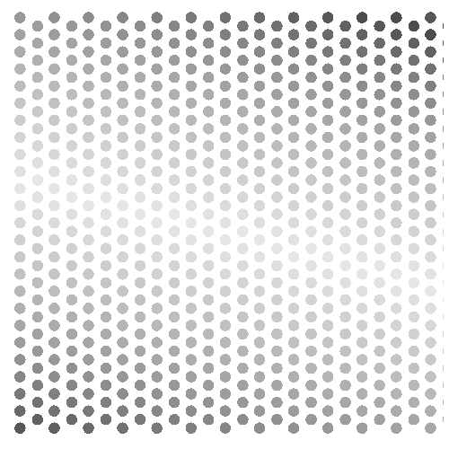

```{r message=FALSE, warning=FALSE, echo=FALSE}
library(tidyverse)
library(gifski)

 shrink.matrix<-matrix(rep(1, 76*49), nrow=76)
    
  curve<-c(rep(1,49), seq(1, .3, length=10),rep(.3,2), seq(.3,1, length=15), rep(1,100))
 
  
  for (thing in 0:75){
    shrink.matrix[(thing+1), ]<-curve[(1+thing):(49+thing)]
  }
```

```{r}
hesitate.wave<-function(){
 
 # for(s in 40:44){
  for(s in 1:76){
    g<-ggplot()+ 
      theme(panel.background = element_rect(fill="white", colour='white'),
            panel.grid.major = element_blank(),
            panel.grid.minor = element_blank())

    for(i in seq(.03, .97, length=13)){
          for(j in seq(.03, .97, length=49)){
            k=0
            w<-(1:49)[j==seq(.03, .97, length=49)]
            z<-(1:13)[i==seq(.03, .97, length=13)]
            shrink<-shrink.matrix[s,]
            adjust<-1-shrink
            if (w/2 ==round(w/2) ){k=.04}
      
            circle.pos<-data.frame(
              x.coord<-sin(seq(0, 2*pi, length=400))*1/78+i+k,
              y.coord<-cos(seq(0, 2*pi, length=400))*1/78*shrink[w]+j-sum(adjust[1:w]*.016)
        )
      
            g<-g+geom_polygon(data=circle.pos,
                                     aes_string(x=x.coord, y=y.coord),
                              #fill=c(rainbow(30), rev(rainbow(30)), 
                               #      rainbow(30))[z+w]
                              fill=c(gray.colors(30), rev(gray.colors(30)), 
                                     gray.colors(30))[z+w]
                              )
    
            }
  
      }
  
    g<-g+ coord_fixed()+
      scale_x_continuous(limits = c(0,1), expand = c(0, 0)) +
      scale_y_continuous(limits = c(0,1), expand = c(0, 0))+
      theme(axis.title.x=element_blank(),
            axis.text.x=element_blank(),
            axis.ticks.x=element_blank(),
            axis.title.y=element_blank(),
            axis.text.y=element_blank(),
            axis.ticks.y=element_blank())
    print(g)

  }
  

  
}

invisible(save_gif(hesitate.wave(), "hesitate_animate_grey.gif", height=500, width=500, delay = 0.1, progress = FALSE))

 

```

