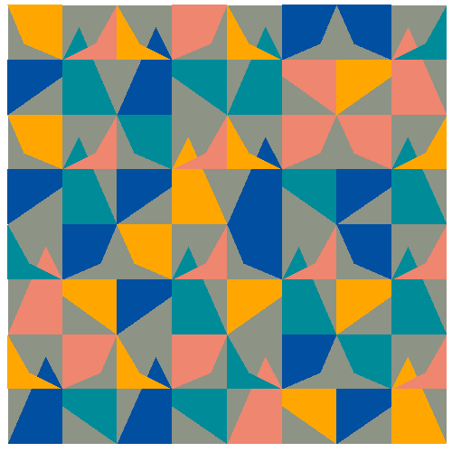

```{r echo=FALSE, message=FALSE, warning=FALSE}
library(tidyverse)
library(gifski)


#------ setting up colors
colors<-c(
  "#008b99", #1 blue green
  "#ee8670", #2 pink
  "#004fa1", #3 blue
  "#ffa700", #4 orange
  "#8d9385" #5 grey
)


steps<-c(seq(.3,.7, by=.11), seq(.7, .3, by=-.05))

odo<-function(){
  for(i in steps){

#------ making one pinwheel shape function

pinwheel<-function(xplus, yplus, seed){
  set.seed(seed)
  rc<-sample(colors[1:4], 4, replace=FALSE)
  flip<-sample(c(1,-1, 1,-1), 1)
  p1<-geom_polygon(
              aes(
                x=c(0, 0, 1, i, 0)*flip+xplus,
                y=c(0, -1, -1,.3+i ,0)+yplus,
               ),
              fill=rc[1])
  p2<-geom_polygon(
              aes(
                x=c(0, -1,-1,-.3+i, 0)*flip+xplus,
                y=c(0, 0, -1, -i,0)+yplus,
               ),
              fill=rc[2])
  p3<-geom_polygon(
              aes(
                x=c(0, 0,-1, i-1, 0)*flip+xplus,
                y=c(0, 1, 1, i, 0)+yplus,
               ),
              fill=rc[3])
  p4<-geom_polygon(
              aes(
                x=c(0, 1,1,.3+i, 0)*flip+xplus,
                y=c(0, 0, 1, i, 0)+yplus,
               ),
              fill=rc[4])
  return(list(p1,p2,p3,p4))
}
set.seed(-i+15)


#----- getting the background

g<-ggplot()+ theme(panel.background = element_rect(fill=colors[5], colour='white'),
                   panel.grid.major = element_blank(),
                   panel.grid.minor = element_blank())


#------ making 4x4 pinwheel grid
shapes<-data.frame(
  x.seq<-rep(seq(0,6, length=4), 4),
  y.seq<-c(rep(0,4), rep(2,4), rep(4,4), rep(6,4)),
  seed<-sample(1:16, 16, replace=TRUE)
  )%>%
  purrr::pmap(., 
            ~pinwheel(xplus=..1, yplus=..2, seed=..3)
            )

#------ putting it together
g<-g+shapes

#------ finishing out the image 
g<-g+  coord_fixed()+
  scale_x_continuous(limits = c(-1,7), expand = c(0, 0)) +
  scale_y_continuous(limits = c(-1,7), expand = c(0, 0))+
  theme(axis.title.x=element_blank(),
        axis.text.x=element_blank(),
        axis.ticks.x=element_blank(),
        axis.title.y=element_blank(),
        axis.text.y=element_blank(),
        axis.ticks.y=element_blank())
print(g)
}
}

invisible(save_gif(odo(), "odo1.gif", delay = 0.1, progress = FALSE, width=500, height=500))  

 


```


