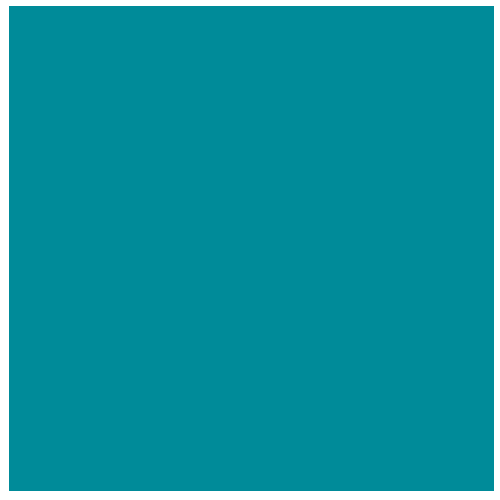

```{r echo=FALSE, message=FALSE, warning=FALSE}
library(tidyverse)
library(gifski)

n=30
squarez<-function(){
  for(i in c(seq(.00001, .3, length=60 ), seq(.31,.7, length=20), seq(.71, 3.8, length=20)))
    {

#------ setting up colors
colors<-c(
  "#008b99", #1 blue green
  "#ee8670", #2 pink
  "#004fa1", #3 blue
  "#ffa700", #4 orange
  "#8d9385" #5 grey
)

#------ making one square
circles<-function(xplus, yplus, lengths){
  x<-sin(seq(0, 2*pi, length=800))*lengths/2 +xplus+lengths/2
  y<-cos(seq(0, 2*pi, length=800))*lengths/2 +yplus-lengths/2
  
  p1<-geom_path( 
               aes(x=x, y=y), 
               size=3,
               color=colors[4])
  
  
  return(list(p1))
}

#------making dataframe for lengths and upper left-hand corner of each square
df<-data.frame(
  lengths<-seq(5*i, min(c(i,.16)), length=21),# 1-.16
  x.seq<-c(0, #1
           0, #2
           lengths[2], #3
           lengths[1], #4
           lengths[1], #5
           lengths[1]-lengths[6], #6
           lengths[1]-lengths[6]-lengths[7], #7
           0-lengths[8], #8
           0-lengths[9], #9
           0-lengths[10], #10
           0-lengths[11], #11
           0, #12
           lengths[12], #13
           sum(lengths[12:13]), #14
           sum(lengths[12:14]), #15
           sum(lengths[12:15]), #16
           rep(sum(lengths[2:3]), 5)), #17-21
  
  y.seq<-c(0, #1
           -lengths[1], #2
           -lengths[1]-lengths[2]+lengths[3], #3
           -lengths[1]-lengths[2]+lengths[3]+lengths[4], #4
           -lengths[1]-lengths[2]+lengths[3]+lengths[4]+lengths[5], #5
           +lengths[6], #6
           +lengths[7], #7
           0, #8
           -lengths[8], #9 
           -sum(lengths[8:9]), #10
           -sum(lengths[8:10]), #11
           -rep(sum(lengths[1:2]), 5), #12-16 
           -sum(lengths[1:2])+lengths[17], #17
           -sum(lengths[1:2])+sum(lengths[17:18]), #18
           -sum(lengths[1:2])+sum(lengths[17:19]), #19
           -sum(lengths[1:2])+sum(lengths[17:20]), #20
           -sum(lengths[1:2])+sum(lengths[17:21])) #21
  )

names(df)<-c("lengths", "x.seq", "y.seq")

#------ making the full design using the squares function and the dataframe of square upper left hand corner locations and side length

shapes<-df%>%
  purrr::pmap(., 
            ~circles(xplus=..2, yplus=..3, lengths=..1)
            )


#----- putting it all together

g<-ggplot()+ theme(panel.background = element_rect(fill=colors[1], colour='white'),
                   panel.grid.major = element_blank(),
                   panel.grid.minor = element_blank())


g<-g+shapes

#------ finishing out the image 
g<-g+  coord_fixed()+
  scale_x_continuous(limits = c(-2.5,3.5), expand = c(0, 0)) +
  scale_y_continuous(limits = c(-4,2), expand = c(0, 0))+
  theme(axis.title.x=element_blank(),
        axis.text.x=element_blank(),
        axis.ticks.x=element_blank(),
        axis.title.y=element_blank(),
        axis.text.y=element_blank(),
        axis.ticks.y=element_blank())


print(g)

  }
  
}
invisible(save_gif(squarez(), "circles.gif", delay = 0.1, progress = FALSE, width=500, height=500))  

 


```


