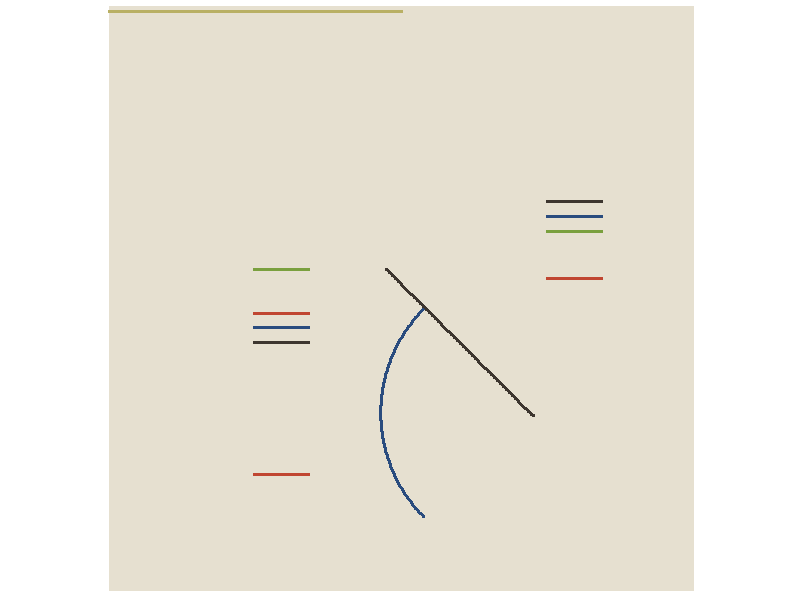

```{r echo=FALSE, message=FALSE, warning=FALSE}
library(tidyverse)
library(gifski)

n<-100

colors<-c(
  "#e6e0d0", #1 background
  "#c04631", #2 red
  "#7aa03e", #3 green
  "#2a4c7e", #4 blue
  "#3d362f", #5 charcoal
  "#b9b064"  #6 greenish yellowish big curve
)

n.steps<-80 #30
steps<-seq(1,n.steps)

bound<-pi/4
scale<-.8
   
first.big.curve.y<- rep(.98, length=n)
last.big.curve.y<-sin(seq(bound*scale, -(bound+.4)*scale, length=n))+.405

first.big.curve.x<- seq(-1,0, length=n)
last.big.curve.x<-cos(seq(bound*scale, -(bound+.4)*scale, length=n))-.9

last.diagonal.x=seq(-.05, .45, length=n)
last.diagonal.y=seq(.10, -.40, length=n)

last.blue.curve.y=sin(seq(bound, -bound, length=n))*.5-.39

last.blue.curve.x=-cos(seq(bound, -bound, length=n))*.5+.43


big.curve.y<-matrix(
  rep(0, n*n.steps), 
  ncol=n.steps)

big.curve.x<-big.curve.y

for(i in 1:n){
  
  big.curve.y[i,1:(n.steps/4)]<-seq(
    first.big.curve.y[i],
    last.big.curve.y[i],
    length=n.steps/4)
  
    big.curve.y[i,(n.steps/4+1):(n.steps/2)]<-seq(
    last.big.curve.y[i],
    last.blue.curve.y[i],
    length=n.steps/4)
    
      big.curve.y[i,(n.steps/2+1):(3*n.steps/4)]<-seq(
    last.blue.curve.y[i],
    -1,
    length=n.steps/4)
    
     big.curve.y[i,(3*n.steps/4+1):(n.steps)]<-seq(
    -1,
    seq(.5, -.5, length=n)[i],
    length=n.steps/4)
     
  big.curve.x[i,1:(n.steps/4)]<-seq(
    first.big.curve.x[i],
    last.big.curve.x[i],
    length=n.steps/4)
  
  big.curve.x[i,(n.steps/4+1):n.steps]<-seq(
    last.big.curve.x[i],
    last.blue.curve.x[i]-.02,
    length=n.steps/4)
  
  big.curve.x[i,(n.steps/2+1):(3*n.steps/4)]<-seq(
    last.blue.curve.x[i]-.02,
    seq(0, .6, length=n)[i],
    length=n.steps/4)
  
   big.curve.x[i,(3*n.steps/4+1):(n.steps)]<-seq(
    seq(0, .6, length=n)[i],
    1,
    length=n.steps/4)
  }


```


```{r message=FALSE, warning=FALSE, echo=FALSE}
hlito<-function(){
  for(j in steps){
    
    g<-ggplot()+ 
      theme(
        panel.background =
          element_rect(fill=colors[1],
                       colour='white'),
        panel.grid.major = element_blank(),
        panel.grid.minor = element_blank())


    #making first curve

    
    big.curve<-data.frame(
      y=big.curve.y[,j],
      x=big.curve.x[,j]
      )

    #small blue curve
    
    small.curve<-data.frame(
     y=last.blue.curve.y,
      x=last.blue.curve.x
      )

    #diagonal 
    
    diagonal<-data.frame(
      y=last.diagonal.y,
      x=last.diagonal.x
      )

    # flat bars
    
    gl<-data.frame(
      x=seq(-0.31695, -.5 ,length=n),
      y=seq(.1, .1, length=n)
      )
    g<-g+
  
      #big curve
      geom_path(data=big.curve, 
                aes(x=x, y=y), 
                colour=colors[6],
                size=1.3,
                lineend = "square"
                )+
  
      #small curve
      geom_path(data=small.curve, 
                aes(x=x, y=y), 
                colour=colors[4],
                size=1.3,
                lineend = "square"
                )+
  
      #black diagonal line
      geom_line(data=diagonal, 
                aes(x=x, y=y), 
                colour=colors[5],
                size=1.3,
                lineend = "square"
                )+
  
      #green line on the left
      geom_line(data=gl,
                aes(x=x, y=y), 
                colour=colors[3],
                size=1.3,
                lineend = "square"
                )+

      #red line on the upper left
      geom_line(data=gl,
                aes(x=x, y=(y-.15)),
                colour=colors[2],
                size=1.3,
                lineend = "square"
                )+ 
  
      #blue line on the left
      geom_line(data=gl,
                aes(x=x, y=(y-.2)),
                colour=colors[4],
                size=1.3,
                lineend = "square"
                )+ 
      #black line on the left
      geom_line(data=gl,
                aes(x=x, y=(y-.25)),
                colour=colors[5],
                size=1.3,
                lineend = "square"
                )+ 
  
      #red line on the lower left
      geom_line(data=gl,
                aes(x=x, y=(y-.7)), 
                colour=colors[2],
                size=1.3,
                lineend = "square"
                )+ 
  
      #red line on the right
      geom_line(data=gl,
                aes(x=x+1, y=(y-.03)), 
                colour=colors[2],
                size=1.3,
                lineend = "square"
                )+ 
  
      #green line on the right
      geom_line(data=gl,
                aes(x=x+1, y=(y+.13)),
                colour=colors[3],
                size=1.3,
                lineend = "square"
                )+
  
      #blue line on the right
      geom_line(data=gl,
                aes(x=x+1, y=(y+.18)),
                colour=colors[4],
                size=1.3,
                lineend = "square"
                )+
      
  
      #black line on the right
      geom_line(data=gl,
                aes(x=x+1, y=(y+.23)),
                colour=colors[5],
                size=1.3,
                lineend = "square"
                )+
  
      coord_fixed()+
      scale_x_continuous(
        limits = c(-1,1), 
        expand = c(0, 0)
        ) +
  
      scale_y_continuous(
        limits = c(-1,1), 
        expand = c(0, 0)
        )+
  
      theme(
        axis.title.x=element_blank(),
        axis.text.x=element_blank(),
        axis.ticks.x=element_blank(),
        axis.title.y=element_blank(),
        axis.text.y=element_blank(),
        axis.ticks.y=element_blank())

    print(g)
    }
  }


invisible(save_gif(hlito(), "hlito_animated.gif", delay = 0.1, progress = FALSE))  


```

